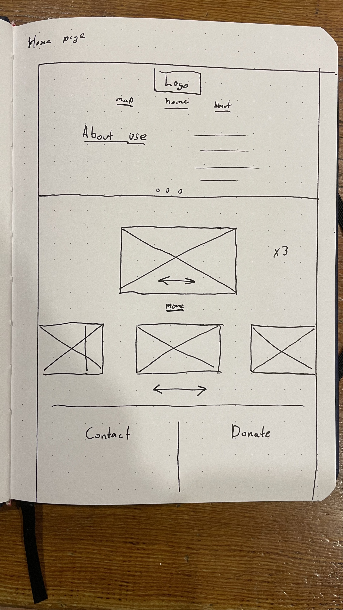
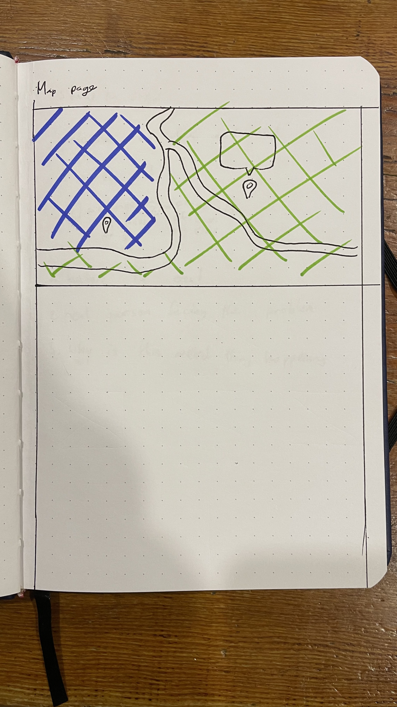

# Layout

The target market is a key consideration in the construction of a web site. For this projects, after careful consideration, three target markets were decided on.
The site was targeted to:

1.	Uni students
2.	Collectors
3.	Artists

Uni student or more specifically University of Canberra (UC) students are one of the most important target market. This is because UC is a closes claoorater with the Canberra Art Biennial. Collectors and artist are both impotent as well due to artist selling their items through Canberra Art Biennial. To make a website that can cater to all these target markets different sections are targeted to different target markets.

The entire website could be narrowed down to two pages. This would make it easier to navigate and make it feel less cluttered.

The current structure of the website contains two pages:

1. Home Page
- Hero image and link to Map page 
- Gallery 
About Canberra Art Biennial
Contact and donate
Footer

2. Map
Map with all art works
Information regarding the artworks and artist.

For this assignment the webpage must be responsive to the viewport width. This means that some elements will stack differently when the page is displayed on different screen sizes. When on a computer screen, the gallery will display in a three column format. But when on a mobile screen the gallery will be in a one column format. The about section and contact/donate section will be shown differently depending on the viewport width.

#Home Page
The Home page contains all the basic information of the event at a glance. This includes things that most people look for and elements that should gain more attention. 

At the top of the home page there is a header with a link to the map page. This encourages people to visit the map and furthermore encouraging people to visit the event in person. Second on the page is the Gallery which is a grid of images showing past and present art works to users. This gives them a great understanding of what the Canberra Art Biennial is all about. It also gets customers more interested in the event. Below the gallery is an about section. This tells people all about Canberra Art Biennial and the history of the event. Lastly are to sections that appear side by side. This is the donate and contact forms. These are placed at the bottom of the page because people who are either wanting to get in contact or donate will have 

#Map
As Canberra Art Biennial is an in person event a map would be the best way to encourage people to visit the event. The map gives an interactive experience for visitors to see all the art works and more information of the art work. It can also help people navigate the event.

#Reflection
Considering the final version of the website, multiple things could have been improved or done in a different way. Firstly, an additional page for more specific information could have been beneficial to spread out the load across the pages. This could have made the existing pages shorter and easier to navigate. 
Secondly I believe more time to think about page layout and design could have made the page more attractive to users. 
Thirdly, more thought could have been given to how the page would be navigated and used. For example if the page should or should not have a navigation bar. 

## bibliography
https://stackoverflow.com/questions/18246053/how-can-i-create-a-link-to-a-local-file-on-a-locally-run-web-page
https://validator.w3.org/nu/#textarea
https://www.w3schools.com
https://css-tricks.com/snippets/css/complete-guide-grid/
